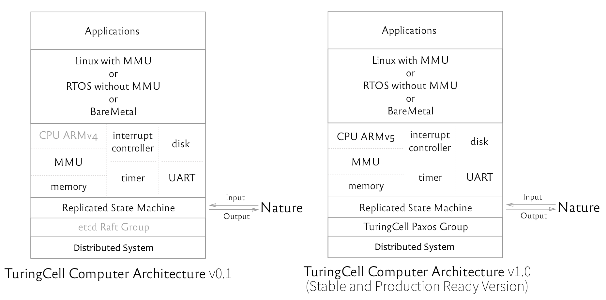

# TuringCell: Run Linux over Paxos/Raft

# TuringCell：在Paxos/Raft算法之上运行Linux操作系统

Note: For the English version of this article please refer to this [link](https://github.com/turingcell/turingcell).

----


本文属于开源项目[TuringCell](https://turingcell.org)。本文重点介绍了Turing Cell计算模型的原理与简单证明，及其对应实现——TuringCell计算机的核心设计思想。

Turing Cell Model是一个运行于分布式一致性算法(如Paxos/Raft)之上的计算机模型，TuringCell计算机是一个Turing Cell Model的开源实现，借助TuringCell，您可以毫不费力地为已有的软件增加高可用、容错、强一致等等分布式系统的特性。同时，TuringCell是一个商业友好的开源项目，它的核心力量源泉是一个开放包容的开源社区，不管您来自哪里，说什么语言，都可以加入进来一起平等自由地讨论、构建TuringCell！

作者：Sen Han (韩森) \<00hnes@gmail.com\>

# Table of Content

   * [0 什么是TuringCell](#0-什么是TuringCell)
   * [1 Turing Cell模型的细节与证明](#1-Turing-Cell模型的细节与证明)
      * [1.1 复制状态机运行模型](#11-复制状态机运行模型)
      * [1.2 普通计算机运行模型](#12-普通计算机运行模型)
      * [1.3 TuringCell定理](#13-TuringCell定理)
   * [2 TuringCell计算机的设计与实现](#2-TuringCell计算机的设计与实现)
      * [2.1 CPU选型](#21-CPU选型)
      * [2.2 核心I/O设备](#22-核心io设备)
      * [2.3 分布式无限长纸带](#23-分布式无限长纸带)
      * [2.4 更详细的设计](#24-更详细的设计)
   * [3 社区、支持与合作](#3-社区支持与合作)
   * [4 捐赠](#4-捐赠)
   * [5 更新历史](#5-更新历史)
   * [6 Copyright and License](#6-copyright-and-license)

## 0 什么是TuringCell

**Turing Cell = Turing Machine + Paxos/Raft**


TuringCell计算机是Turing Cell计算模型的实现，就像普通的计算机是图灵机计算模型的实现一样。

TuringCell计算机与普通的计算机之间没有太大的区别——除了前者是运行于Paxos/Raft等分布式一致性算法之上的以外。正是由于这一特点，使得TuringCell计算机天生拥有高可用、强一致、一定的容错能力等一个Paxos/Raft组所能拥有的一切特性，除了这些基本特性以外，它还可以拥有分布式系统的成员集合变更，Multi-Master（基于Paxos算法的情况下）等等一个Paxos/Raft组的具体实现特性。

所以，您可以在一个TuringCell计算机之上运行任何操作系统及其对应的应用程序，只要这个操作系统支持此TuringCell计算机具体实现的指令集架构（ISA）与核心的I/O设备。除了可以运行需要MMU支持的Linux操作系统之外，您还可以在TuringCell计算机之上运行不需要MMU支持的嵌入式实时操作系统（RTOS）。另外，如果您十分关注此分布式应用的性能，您甚至还可以选择以BareMetal的形式运行完全由您自己定制的系统。

什么是“Cell”？

细胞是生物组织的基本元素之一。一般的生物组织在受到一定程度的非致命性伤害后，能够进行损伤的自我恢复，这在生物学上被称为“再生”。在组织再生的同时，组织能保证其在整体系统中的功能处于一定程度的正常状态。而TuringCell计算机的最初设计意图之一就是要拥有一定程度地与之类似的生物再生特性。

## 1 Turing Cell模型的细节与证明

### 1.1 复制状态机运行模型


“复制状态机”模型(Replicated State Machines, abbr. RSM)：

&emsp;基于分布式一致性算法（比如通过将无穷多个Paxos运行实例顺序地组合在一起，相关更多的内容请阅读《[Paxos Made Easy](https://github.com/turingcell/paxos-made-easy)》），构建出一个强一致的、具有一定容错能力的、高可用的无限长分布式指令纸带，多个具有相同起始状态的状态机执行者从前到后依次地执行纸带上的指令，假如说每一条指令都是数学确定的，那么可以肯定的是，当所有状态机执行者在执行完纸带上相同位置的某一个相同指令时，所有状态机的内部状态都必然是相同的，这种运行模型被称为“复制状态机模型”。复制状态机的实质就是通过一个强一致的、具有一定容错能力的、高可用的无限长分布式指令纸带得到一个强一致的、具有一定容错能力的、高可用的分布式状态机。

定义数学确定函数𝘮𝘥𝑓 (Mathematical Deterministic Function):

&emsp;**数学确定函数𝘮𝘥𝑓**&emsp;**在任何情况之下，只要给mdf函数一个确定的输入状态S1，那么就必然能够唯一地、确定地映射到一个确定的输出状态S2，即**

&emsp;&emsp;**S2 = mdf(S1)**

如此，我们可以得到“mdf”函数版的RSM定义

&emsp;多个具有相同起始状态的状态机执行者从前到后依次地执行此分布式指令纸带上的指令——即mdf函数，由于mdf函数的特性，那么可以肯定的是，当所有状态机执行者在执行完纸带上相同位置的某一个特定𝘮𝘥𝑓函数时，所有状态机的内部状态都必然是相同的，这种运行模型我们称之为”复制状态机“模型

如下图所示


### 1.2 普通计算机运行模型


```
state{cpu regsters' state, memory state, i/o devices' state}
```

从某种意义上讲，计算机的运行可以看成是一个连续的状态迁移序列。

为了简化模型，我们下面将讨论只拥有单周期指令的计算机，当然这些结论可以很容易地推广到更一般的计算机运行模型中去。

&emsp;假设将运行中的计算机在t1时钟周期开始时的状态记为S1，t2时钟周期开始时的状态记为S2，已知t2>t1，那么必然会存在一种状态映射的函数f，使得

&emsp;**S2 = f(S1)**

&emsp;那么我们可以把计算机的运行看成是一个又一个这样的f函数（即当前时钟周期要执行的CPU指令所等价的f函数）的依次执行。

如下图所示


### 1.3 TuringCell定理

综上，我们可以得到

&emsp;**TuringCell定理**&emsp;**对于一个普通计算机运行模型𝒞，其𝑓函数为𝑓n，其中n为任意非负整数，假如存在一个复制状态机运行模型ℛ，其𝘮𝘥𝑓函数为𝘮𝘥𝑓n，其中n为任意非负整数，若有对于任意的n，𝑓n与𝘮𝘥𝑓n均是等价的条件成立，那么我们可以称𝒞与ℛ是状态迁移等价的**

对于一般的计算机而言，所有的CPU指令都可以看成是一种mdf函数，唯一向系统的状态中引入“随机”成分的是I/O设备--其根本原因在于I/O的本质是系统与自然界的交互。为了将所有的I/O设备给mdf函数化，此处可以将所有能产生“随机”数据的部分移出RSM复制状态机--即通过向RSM复制状态机的指令执行中引入I/O机制使得其能够与外界进行数据交互来实现对I/O设备的mdf函数化，那么，综上可得，对于一般的计算机模型而言 

&emsp;**TuringCell定理中阐述的这种等价描述是存在并且可以被实现的**

## 2 TuringCell计算机的设计与实现



TuringCell计算机v0.1为最小原型验证，v1.0版本为正式版本，可用于生产环境。

### 2.1 CPU选型

```
x86 or x64
    工程量大 单纯的体力活 由于CISC-CPU的解码器更复杂 所以CISC-CPU的解释性能相比RISC-CPU会有一定的劣势
    工具链生态繁荣度: 优秀
    可维护性: 差
arm
    实现难度: RSIC 实现难度低 解码简单 指令相比CISC更简洁
    工具链生态繁荣度: 良 开发活跃
    可维护性: 优
mips
    实现难度: RSIC 实现难度低 解码简单 指令相比ARM更简洁
    工具链生态繁荣度: 不太乐观 gcc上mips的提交频率相比arm低太多了
    可维护性: 优

CISC指令译码多路并行mutiplexer实现对于FPGA/AISC等硬件电路来说是拿手好戏，但对串行的CPU核心来说就不那么性能亲和了，相比之下RISC的译码就简单直接很多了。

--> 最终决定v0.1版本选择模拟ARMv4架构，于v1.0正式发布版本加入ARMv5架构
```

除此以外，TuringCell计算机支持用来扩展其它种类CPU实现的插件。

### 2.2 核心I/O设备

timer：至关重要，比如用于实现操作系统中多任务之间的分时抢占。

UART：可能是最简单的能够与外界进行信息交互的通用I/O设备了，比如可以用于Console控制台，或者单纯地作为与外部的其他系统进行通讯的数据链路。

Disk：持久存储块设备。

interrupt controller：监听所有I/O设备的事件状态，并将其中CPU所关心的信息以事件的形式通知到CPU，即给CPU提供了除对I/O设备的状态寄存器进行轮询之外的另一个选项。

除此以外，TuringCell计算机支持用来扩展其它种类I/O设备实现的插件。

### 2.3 分布式无限长纸带

v0.1版本作为原型验证版本先临时使用用etcd。

v1.0版本作为第一个正式稳定的发布版本使用TuringCell社区自己开发的、基于Paxos算法的专门分布式无限长纸带实现，包含但不限于以下特性：

1. 平等主义
2. 多Master
3. 乱序并发提交
4. 基于可变权重的Master动态选举与设置
5. 成员集合变更
6. 单RTT chosen
7. 广域网环境优化
8. 服务化，可以成为任何其它项目中的一个基础组件，目标是成为业界分布式一致性算法开源实现中的最优选择之一
9. 其它任何很酷的idea 欢迎分享您的想法

### 2.4 更详细的设计

关于实现更具体的设计请参见[此文档](https://github.com/turingcell/turingcell/blob/master/design_in_detail.md)。

## 3 社区、支持与合作

欢迎您加入[TuringCell社区](https://github.com/turingcell/join-community)！

您的加入、支持与反馈对此开源项目至关重要！思想的交流，思维的碰撞，开放包容，平等自由，正是开源的迷人魅力之所在！成为TuringCell社区中的一员，让我们一起构建下一个激动人心的分布式开源项目！

您可以选择加入邮件列表、加入微信群、申请成为Github TuringCell组织成员、分享传播、提出疑问、Star/Watch/Follow、捐赠等等任何方式来支持此项目。

此外，任何形式的合作，只要有益于此开源项目的良性发展，都是十分欢迎的，请您[联系](https://github.com/turingcell/contact)我。

## 4 捐赠

十分感谢您的[慷慨捐赠](https://github.com/turingcell/donate)！

## 5 更新历史

```
v0.01 2017.5
    Sen Han (韩森) <00hnes@gmail.com>

v0.2  2017.12-2018.2 
    Sen Han (韩森) <00hnes@gmail.com>

v0.9   2020.5 
    Sen Han (韩森) <00hnes@gmail.com>
```

## 6 Copyright and License

Author: Sen Han (韩森) <00hnes@gmail.com>

Website: https://turingcell.org/

License: This article is licensed under the [Creative Commons Attribution-ShareAlike 4.0 International License](https://creativecommons.org/licenses/by-sa/4.0/), except the picture of the [TuringCell Logo](https://github.com/turingcell/logo) which is under the [Creative Commons Attribution-NoDerivatives 4.0 International License](http://creativecommons.org/licenses/by-nd/4.0/).

本文开头处的[TuringCell Logo](https://github.com/turingcell/logo)图片采用[知识共享署名-禁止演绎 4.0 国际许可协议](http://creativecommons.org/licenses/by-nd/4.0/)进行许可，文中除此logo之外的部分均采用[知识共享署名-相同方式共享 4.0 国际许可协议](https://creativecommons.org/licenses/by-sa/4.0/)进行许可。
